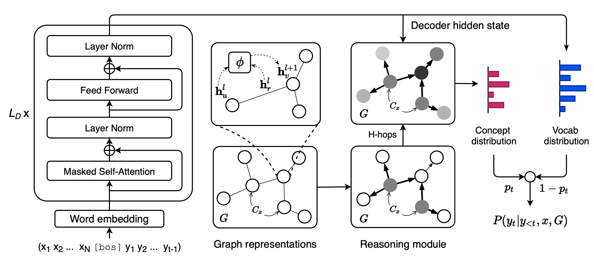

# Topic Transition Through Dialogue Using Multigen

## Introduction
This is a PyTorch implementation of a chatbot that can smoothly guide the conversation to some specific topics. 


### Model
We use [Multigen](https://github.com/cdjhz/multigen) as our generation model. 



### Dataset
The dataset is generated from `facebook/blenderbot-400M-distill` by ourselves.

| Train |  Dev  |
| ----- | ----- |
| 17683 |  1965 |

## Requirements
- spacy==3.3.0
- torch==1.11.0
- transformers==4.19.0
- fairseq==0.10.0
- nltk==3.4.5
- networkx==2.1
- datasets
- torch-scatter

## Usage

### Inference
```
python simulator.py \
--split test \
--num_chats 980 \
--model_name_or_path [/path/to/model]
```

### Display results
#### Format chats
```
python formatDialogue.py -f [/path/to/output.jsonl]
```
#### Display
```
cat output-formatted.txt
```

### Evaluation
The evaluation metric we use is ```hit rate```, which is the percentage of conversations that contain keywords in all conversations.

```
python hit.py --prediction [/path/to/output.jsonl]
```

## Reference
- [SalesBot: Transitioning from Chit-Chat to Task-Oriented Dialogues](https://arxiv.org/abs/2204.10591)
- [Multigen](https://github.com/cdjhz/multigen)